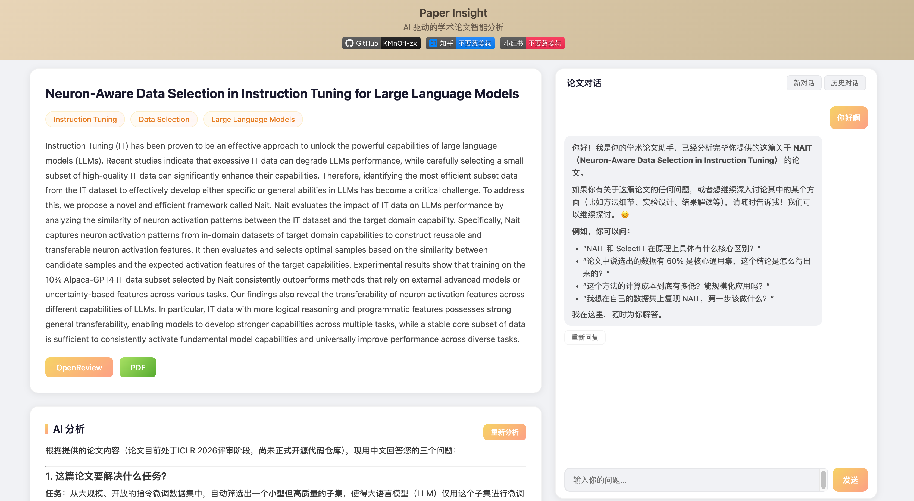

<div align='center'>


<h1><a href="https://paper-online.onrender.com">Paper Insight</a></h1>

[English](./README.md) | 简体中文

</div>

## 🎯 项目介绍

*&emsp;&emsp;做这个工具的起因是，老板说要看足够多的论文才会有很好的 idea 或 insight ，我觉得很对。（感谢王老师的读论文 Prompt）所以用 dify 联合飞书做了工作流，但是每次只手动输入能看一篇；后来做了好几个仓库用于批量拉取AI会议的论文，这样我可以直接看然后跳转到 dify 工作流；再然后我觉得 dify 太慢了，于是 vibe 了一个更快的工具 paper insight，直接在本地就能快速分析论文，看看摘要、关键词、相关工作推荐等，觉得有潜力就收藏到zotero里精读；我又觉得每次新的会议出来我就得新搞一个仓库太麻烦了，于是写了一个通用的爬虫脚本，能批量导入会议论文；最后我觉得如果能直接在这个工具里浏览会议论文就更好了，于是又加了一个会议浏览的功能，支持分页和关键词搜索。so，果然省事才是第一生产力。如果你喜欢这个项目，欢迎点个star哦~*

&emsp;&emsp;Paper Insight 是一个基于 FastAPI 和 PostgreSQL 的在线论文分析工具，利用 LLM 技术为用户提供快速论文分析和交互式对话能力，帮助研究人员快速理解和筛选学术论文。

&emsp;&emsp;本项目旨在辅助快速浏览 AI 会议论文。通过 AI 快速生成摘要，用户可决定是否将论文收藏至 Zotero 进行精读。目前仅支持 OpenReview 平台上的论文，作为作者个人论文阅读工作流的一部分，暂无计划支持其他平台。

***&emsp;&emsp;可访问  https://paper-online.onrender.com 在线体验，或按照以下步骤在本地部署。***

&emsp;&emsp;已支持：[ICLR 2026](https://paper-online.onrender.com/conference/iclr_2026), [NeurIPS 2025](https://paper-online.onrender.com/conference/neurips_2025), [ICML 2025](https://paper-online.onrender.com/conference/icml_2025)

> *注：默认 LLM 提供商为 OpenRouter，当前使用 `stepfun/step-3.5-flash:free`。后续将支持更多会议论文，并统一格式。*

### 🤔 为什么不用 [cool papers](https://papers.cool/)？

&emsp;&emsp;cool papers 是苏神开发的优秀论文阅读工具，但两者的设计理念不同：

| 对比维度 | Paper Insight | cool papers |
|---------|--------------|-------------|
| **定位** | 快速筛选论文 | 深度理解论文 |
| **分析问题数** | 4 个核心问题 | 6 个详细问题 |
| **核心问题** | • 代码开源吗？<br>• 解决什么任务？<br>• 用什么评估指标？<br>• 为什么比 Baseline 好？ | • 试图解决什么问题？<br>• 有哪些相关研究？<br>• 如何解决这个问题？<br>• 做了哪些实验？<br>• 可进一步探索的点？<br>• 总结主要内容 |
| **适用场景** | 第一时间判断论文价值，决定是否精读 | 全面理解论文细节和研究脉络 |
| **额外功能** | • 会议论文批量浏览<br>• 字段过滤搜索<br>• 论文对话 | • 详细的论文解读<br>• 完整的研究背景 |

&emsp;&emsp;**简而言之**：Paper Insight 专注于"快速筛选"，帮你在海量论文中找到值得精读的那几篇；cool papers 专注于"深度理解"，帮你全面掌握一篇论文的方方面面。两者互补，可根据需求选择。

## ✨ 功能特性

### 📄 论文分析
- **快速分析**：输入 OpenReview 论文 ID，AI 会回答 4 个核心问题：是否开源代码、论文解决什么任务、使用什么评估指标、为什么能优于 baseline
- **智能缓存**：分析结果自动保存到数据库，再次访问秒开
- **重新分析**：支持重新生成分析结果
- **流式输出**：实时显示 AI 分析过程，无需等待

### 🗂️ 会议浏览
- **批量浏览**：支持 NeurIPS 2025、ICLR 2026 等会议的所有论文
- **分页展示**：每页 8 篇论文，支持页面跳转
- **字段过滤搜索**：可选择在标题、摘要、关键词中搜索，精准定位目标论文
- **快捷键**：Shift+Enter 快速搜索
- **智能缓存**：24小时缓存，二次访问秒开

### 💬 论文对话
- **智能问答**：基于论文内容进行多轮对话
- **上下文记忆**：保持对话上下文，理解连续提问
- **历史会话**：自动保存对话历史，随时查看
- **重新生成**：支持重新生成最后一条回复

### 🔧 其他功能
- **在线人数**：实时显示当前在线用户数
- **批量导入**：支持从 JSONL 文件批量导入会议论文
- **响应式设计**：支持桌面和移动端访问

## 快速开始

### 1. 安装依赖

后端依赖：

```bash
uv sync
```

前端依赖：

```bash
cd frontend-react
npm install
```

### 2. 准备本地 PostgreSQL 16

推荐使用 Homebrew 安装：

```bash
brew install postgresql@16
brew services start postgresql@16
createdb paper_online
```

### 3. 配置环境变量

在 `backend/` 目录下创建 `.env` 文件，并填入以下内容：

```bash
DATABASE_URL=postgresql:///paper_online
OPEN_ROUTER_API_KEY=your_api_key_here
```

如果你想手动切换 LLM 提供商，也可以额外配置 `SILICONFLOW_API_KEY` 等可选变量，但当前默认运行路径使用的是 `OPEN_ROUTER_API_KEY`。

初始化数据库结构：

```bash
uv run python scripts/apply_migrations.py
```

如需最小开发数据：

```bash
uv run python scripts/apply_migrations.py --seed dev
```

### 4. 开发模式启动

先启动后端：

```bash
cd backend
uv run uvicorn app:app --reload --host 127.0.0.1 --port 8000
```

再在另一个终端启动 React 前端：

```bash
cd frontend-react
npm run dev
```

### 5. 访问页面

开发模式下：
- 前端：`http://127.0.0.1:5173`
- 后端 API：`http://127.0.0.1:8000`

推荐访问路径：
- 首页：`http://127.0.0.1:5173/`
- 全局搜索：`http://127.0.0.1:5173/search?q=agent`
- 会议页：`http://127.0.0.1:5173/conference/iclr_2026`
- 论文详情页：`http://127.0.0.1:5173/papers/uq6UWRgzMr`

搜索仅在以下两种方式下触发：
- 点击搜索按钮
- 按 `Shift+Enter`
旧的查询参数链接形式，如 `/?id=...`、`/?conference=...`、`/?search=...`，已经不再支持。

## 停止服务

在两个终端分别按 `Ctrl + C`，停止后端和前端开发服务。

## 👩‍💻 开发者指南

这一节只关注本地开发最常见的三件事：

1. 如何启动 / 停止本机 PostgreSQL
2. 如何准备本地开发数据库
3. 如何准备本地开发数据

### 1. 启动 / 停止本机 PostgreSQL

如果你使用 Homebrew 安装的是 `postgresql@16`，最常用的命令如下：

```bash
# 启动
brew services start postgresql@16

# 停止
brew services stop postgresql@16

# 重启
brew services restart postgresql@16

# 查看状态
brew services list | grep postgresql@16
```

如果你只是临时调试，也可以不用注册成后台服务，而是手动前台启动；但对这个项目来说，直接用 `brew services` 最省事。

### 2. 准备本地开发数据库

推荐默认库名就叫 `paper_online`。

```bash
# 只需执行一次
createdb paper_online

# 初始化表结构、索引、搜索函数
DATABASE_URL=postgresql:///paper_online uv run python scripts/apply_migrations.py
```

如果你要清空重来：

```bash
dropdb --if-exists paper_online
createdb paper_online
DATABASE_URL=postgresql:///paper_online uv run python scripts/apply_migrations.py
```

### 3. 本地开发有两种数据准备方式

#### 方式 A：最小开发数据

适合只想快速启动页面、联调接口，不需要完整线上数据。

```bash
DATABASE_URL=postgresql:///paper_online uv run python scripts/apply_migrations.py --seed dev
```

#### 方式 B：从 `crawled_data/` 重新导入

适合你不想依赖线上 dump，或者想重建 / 补充某个会议的数据。

先确保已经初始化数据库：

```bash
DATABASE_URL=postgresql:///paper_online uv run python scripts/apply_migrations.py
```

然后按会议导入：

```bash
uv run python scripts/import_papers.py --conference neurips_2025
uv run python scripts/import_papers.py --conference iclr_2026
uv run python scripts/import_papers.py --conference icml_2025
```

说明：

- 数据源目录固定为 `crawled_data/{conference}/`
- 导入是**按论文覆盖式刷新**
- `papers` 会 upsert
- 对应论文的 `authors` / `keywords` 会先删后插
- `llm_response` 不会在导入阶段生成，后续由用户访问或后台分析补全

### 4. 推荐的本地开发顺序

如果你是新贡献者，最省心的顺序是：

```bash
brew services start postgresql@16
createdb paper_online
cp backend/.env.example backend/.env
# 编辑 backend/.env，填入 OPEN_ROUTER_API_KEY
DATABASE_URL=postgresql:///paper_online uv run python scripts/apply_migrations.py --seed dev
cd backend && uv run uvicorn app:app --reload --host 127.0.0.1 --port 8000
cd frontend-react && npm run dev
```

## 部署

### 部署模式

当前有两种运行模式：

1. 开发模式
   - FastAPI 和 `frontend-react` 分开启动。
   - 适合本地开发和调试 UI。

2. 生产模式
   - 先构建 `frontend-react`。
   - 再由 FastAPI 直接托管 React 构建产物。
   - 生产环境只需要运行一个服务。

### 本地模拟生产运行

先构建前端：

```bash
cd frontend-react
npm run build
```

再启动 FastAPI：

```bash
cd backend
uv run uvicorn app:app --host 0.0.0.0 --port 8000
```

然后访问：

```text
http://127.0.0.1:8000
```

如果 `frontend-react/dist` 不存在，FastAPI 现在会直接返回明确错误，提示先构建前端；不会再静默回退到旧静态前端。

### Docker / VPS 部署

仓库已经包含可直接使用的 [Dockerfile](./Dockerfile)。
它会自动：
- 构建 `frontend-react`
- 将 `frontend-react/dist` 复制进最终镜像
- 在启动前自动执行 PostgreSQL migration
- 启动 FastAPI

推荐在 VPS 上直接使用 `docker compose`：

```bash
cp .env.example .env
# 按需修改 POSTGRES_PASSWORD、OPEN_ROUTER_API_KEY 等变量
docker compose up --build -d
```

如果你只想构建单个应用镜像：

```bash
docker build -t paper-insight .
```

容器运行时需要可用的 `DATABASE_URL`，在 VPS 上推荐直接通过 `docker-compose.yml` 统一注入。

## 项目结构

```
paper_online/
├── backend/
│   ├── app.py          # FastAPI 主应用
│   ├── chat.py         # 聊天会话管理
│   ├── database.py     # PostgreSQL 数据库操作
│   ├── llm.py          # LLM 调用封装
│   ├── prompt.py       # 系统提示词
│   └── utils.py        # 工具函数
├── db/
│   ├── migrations/     # PostgreSQL 初始化与搜索函数
│   └── seeds/          # 本地开发小样本数据
├── frontend-react/
│   ├── src/            # React 前端源码
│   ├── dist/           # 前端构建产物
│   └── vite.config.ts  # Vite 配置
├── scripts/
│   ├── apply_migrations.py # 执行 migration / seed
│   ├── import_papers.py    # 批量导入论文
│   └── migrate_db.sql      # 单文件版数据库迁移
└── crawled_data/         # 爬虫数据存储
    ├── neurips_2025/
    └── iclr_2026/
```

## 📦 批量导入论文

如果你有会议论文的 JSONL 数据文件，可以使用以下命令批量导入：

```bash
uv run python scripts/import_papers.py --conference neurips_2025
uv run python scripts/import_papers.py --conference iclr_2026
uv run python scripts/import_papers.py --conference icml_2025
```

数据文件应放在 `crawled_data/{conference}/` 目录下。

## License

Apache 2.0 License
